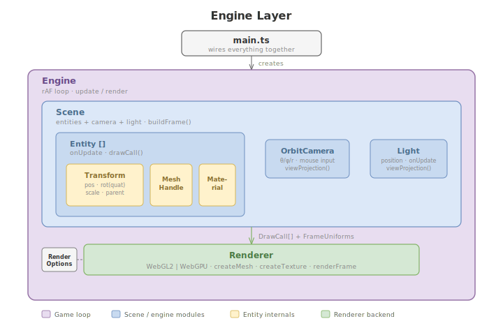
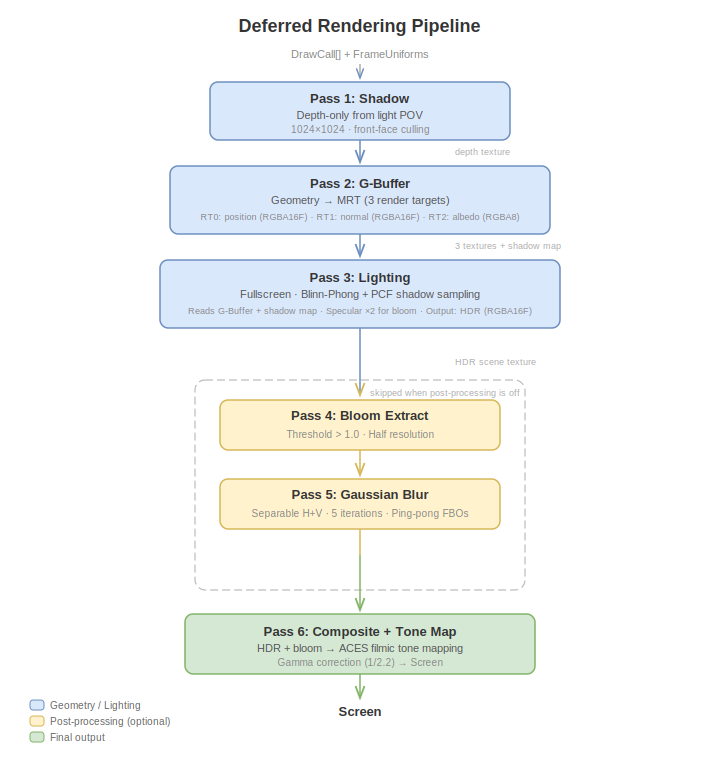
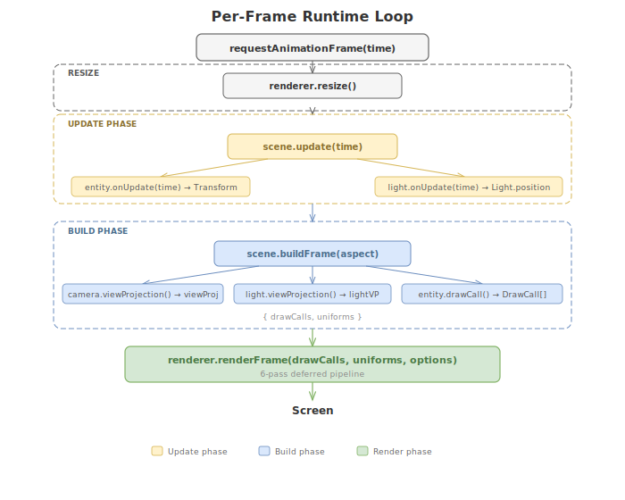

# Architecture

How the rendering engine works, from entry point to pixels on screen.

## File Map

```
src/
  main.ts              Entry point — wires renderer, assets, entities, engine
  objParser.ts         Wavefront OBJ file parser (position + UV + normal)
  tangents.ts          Per-triangle tangent computation for normal mapping
  engine/
    Renderer.ts        Backend-agnostic interface (the contract)
    WebGL2Renderer.ts  WebGL2 implementation (GLSL shaders inline)
    WebGPURenderer.ts  WebGPU implementation (WGSL shaders inline)
    Transform.ts       Position/rotation(quat)/scale + parent-child hierarchy
    Material.ts        Bundles texture + normalMap
    Entity.ts          Transform + mesh + material + onUpdate callback
    OrbitCamera.ts     Camera state + mouse/wheel orbit controls
    Light.ts           Light position + shadow view-projection
    Scene.ts           Entity list + camera + light; builds DrawCall[]/FrameUniforms
    Engine.ts          Owns rAF loop with update/render separation
    Mesh.ts            VAO/VBO helper (early abstraction, Step 6)
    ShaderProgram.ts   Shader compilation helper (early abstraction, Step 6)
    Texture.ts         Texture wrapper (early abstraction, Step 6)
    index.ts           Barrel exports
```

`Mesh.ts`, `ShaderProgram.ts`, and `Texture.ts` are Step 6 abstractions. The full-pipeline renderers now handle resource creation internally, so these are largely vestigial but still exported.

## Renderer Interface

`src/engine/Renderer.ts` defines the contract both backends implement:

| Type | Purpose |
|------|---------|
| `Renderer` | `createMesh()`, `createTexture()`, `resize()`, `renderFrame()` |
| `DrawCall` | mesh + texture + optional normalMap + model matrix |
| `FrameUniforms` | viewProj, lightPos, cameraPos, lightViewProj |
| `RenderOptions` | boolean toggles: shadows, normalMaps, postProcessing |
| `MeshHandle` | Opaque handle with `vertexCount` |
| `TextureHandle` | Opaque handle (backends attach their own data) |

`Engine` and `Scene` program against this interface. Backend is selected at startup via `?backend=` query parameter — WebGPU is attempted first, with WebGL2 as fallback.

## Engine Layer

Above the `Renderer` sits the engine layer (added in Step 14). These modules handle scene management and the game loop:

| Module | Purpose |
|--------|---------|
| `Transform` | Position (`vec3`), rotation (`quat`), scale (`vec3`) with parent-child hierarchy. `worldMatrix()` walks the parent chain. |
| `Material` | Interface bundling `TextureHandle` + optional normal map. |
| `Entity` | Combines `Transform` + `MeshHandle` + `Material`. Optional `onUpdate(time)` callback for per-frame behavior. `drawCall()` produces a `DrawCall` for the renderer. |
| `OrbitCamera` | Encapsulates theta/phi/radius orbit state and mouse/wheel input. `attach(canvas)` binds listeners. `viewProjection(out, aspect)` builds the VP matrix. |
| `Light` | Light position with optional `onUpdate` animation. `viewProjection(out)` builds the shadow-map VP matrix. |
| `Scene` | Holds `Entity[]`, `OrbitCamera`, and `Light`. `update(time)` ticks everything; `buildFrame(aspect)` returns `{ drawCalls, uniforms }`. |
| `Engine` | Owns the `requestAnimationFrame` loop. Calls `scene.update()`, `scene.buildFrame()`, and `renderer.renderFrame()` each frame. |

`main.ts` creates the renderer, loads assets, builds entities/scene, and calls `engine.start()`.



## Rendering Pipeline

Both backends implement an identical 6-pass deferred pipeline:



The UI exposes three `RenderOptions` toggles that modify the pipeline at runtime:

| Toggle | Effect |
|--------|--------|
| **Shadows** | Off → shadow pass is skipped; lighting reads no shadow map (everything lit) |
| **Normal Maps** | Off → G-Buffer uses geometric normals; a flat 1×1 normal texture replaces the normal map |
| **Post-Processing** | Off → bloom extract + blur passes are skipped; composite copies HDR to screen with no tone mapping |

## Shaders

All shaders are **inline string constants** at the top of each renderer file. WebGL2 uses GLSL 300 es; WebGPU uses WGSL. They are intentionally duplicated across backends (not shared) because the languages differ in syntax and the project values self-contained, readable files over DRY.

| Pass | WebGL2 (GLSL) | WebGPU (WGSL) |
|------|---------------|---------------|
| Shadow | `SHADOW_VERT` + `SHADOW_FRAG` | `SHADOW_SHADER` |
| G-Buffer | `GBUF_VERT` + `GBUF_FRAG` | `GBUF_SHADER` |
| Lighting | `FULLSCREEN_VERT` + `LIGHT_FRAG` | `LIGHT_SHADER` |
| Bloom Extract | `FULLSCREEN_VERT` + `BLOOM_EXTRACT_FRAG` | `BLOOM_EXTRACT_SHADER` |
| Blur | `FULLSCREEN_VERT` + `BLUR_FRAG` | `BLUR_SHADER` |
| Composite | `FULLSCREEN_VERT` + `COMPOSITE_FRAG` | `COMPOSITE_SHADER` |

Post-processing passes use a **fullscreen triangle** generated from the vertex index (no vertex buffer needed). The vertex shader emits a single oversized triangle covering the viewport.

## Vertex Layout

Interleaved, 11 floats per vertex (44 bytes stride):

| Offset | Attribute | Components | Location |
|--------|-----------|------------|----------|
| 0 | position | 3 | 0 |
| 12 | texCoord | 2 | 1 |
| 20 | normal | 3 | 2 |
| 32 | tangent | 3 | 3 |

`objParser.ts` outputs 8 floats/vertex (position + UV + normal). `tangents.ts` computes per-triangle tangent vectors and expands to 11 floats/vertex. Ground plane geometry is constructed with tangents directly in `main.ts`.

## Backend Differences

| Concern | WebGL2 | WebGPU |
|---------|--------|--------|
| Init | Synchronous constructor | Async `static create()` factory |
| Uniforms | `gl.uniform*()` per draw | Uniform buffers + `device.queue.writeBuffer()` |
| Textures | `gl.bindTexture()` to units | Bind groups with texture views |
| NDC depth | [-1, 1] (OpenGL convention) | [0, 1] — remapped in vertex shader |
| UV in fullscreen | Standard | Y-flipped for correct orientation |
| FBOs | `WebGLFramebuffer` + `WebGLRenderbuffer` | `GPUTexture` with `RENDER_ATTACHMENT` usage |
| Extension | Requires `EXT_color_buffer_float` for HDR | Native float texture support |

## Runtime Loop

`Engine.start()` drives the frame loop via `requestAnimationFrame`:



1. **Resize** — `renderer.resize()` syncs canvas to display size
2. **Update** — `scene.update(time)` calls each entity's `onUpdate` callback (torus rotation, light orbit)
3. **Build frame** — `scene.buildFrame(aspect)` collects `DrawCall[]` and `FrameUniforms` from all entities, camera, and light
4. **Render** — `renderer.renderFrame(drawCalls, uniforms, options)` runs the 6-pass deferred pipeline
